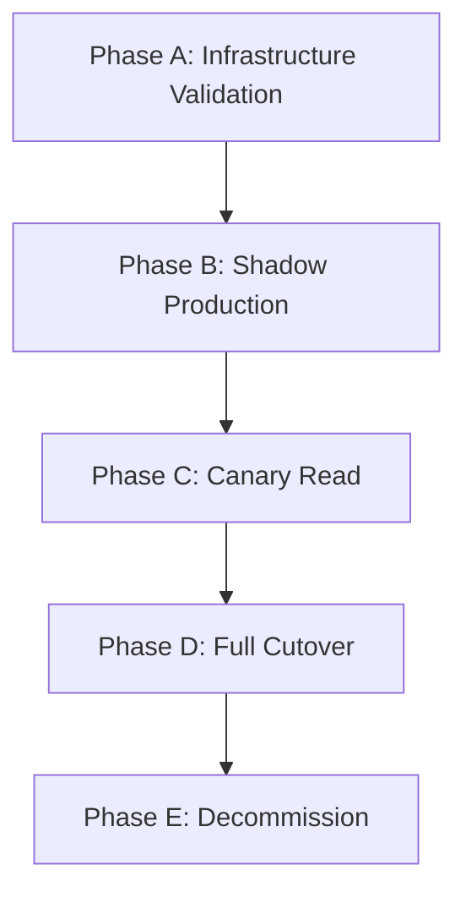

# 🛡️ PostgreSQL Migration Certification Runbook & Matrix
**Fase:** Migration Certification Phase | **Version:** 1.0.0 | **Owner:** Principal SRE & Database Migration Lead

This document serves as the formal operational playbook and safety framework for certifying the PostgreSQL migration. All migration gates, execution phases, and automatic abort conditions are defined herein.

---

## 📅 Roadmap: The 5 Certification Phases

To ensure zero downtime and high availability, the migration will proceed through five sequential phases:



### Phase A — Infrastructure Validation
* **Objective:** Verify database connectivity, API schemas, and readiness under simulated network conditions using the automated runner on live database instances.
* **Duration:** 1 Day
* **Requirements:** Set target `DATABASE_URL` and credentials, then execute:
  ```bash
  node scripts/readiness/runner.js
  ```
  All core gates must pass (`Score >= 90/100`).

### Phase B — Shadow Production
* **Objective:** Enable dual writes to Postgres while maintaining Firestore as the single source of truth. Read traffic remains 100% on Firestore.
* **Duration:** 7–14 Days
* **Requirements:** Keep `DATABASE_PROVIDER=FIRESTORE` (or `DUAL_WRITE`), observe parity logs, and ensure mismatch rates are resolved to zero.

### Phase C — Canary Read
* **Objective:** Route a controlled subset (1% to 5%) of read queries to PostgreSQL. Monitor latency and error rates.
* **Duration:** 3–7 Days
* **Requirements:** Slowly increase traffic allocation while verifying that the shadow circuit breaker remains closed.

### Phase D — Full Cutover
* **Objective:** PostgreSQL becomes the primary database. Firestore remains active in shadow mode (receiving dual writes) as a hot-standby.
* **Duration:** 14 Days (Observation period)
* **Requirements:** Set `DATABASE_PROVIDER=POSTGRES` after passing the formal **Migration Certification Review (MCR)** gate.

### Phase E — Decommission
* **Objective:** Retire Firestore completely from the read/write paths and clean up technical debt.
* **Requirements:** Executed only if no drifts, rollbacks, or SLA regressions occur for 30 consecutive days.

---

## 🔒 Feature Lock Policy

During the Migration Certification Phase, the following engineering locks are strictly enforced to prevent regressions:
* **No Feature Development:** All feature requests are frozen.
* **No Code Refactoring:** Code changes are limited to critical blocker bug fixes.
* **No Database Schema Changes:** DB schema is frozen unless required for a critical data migration fix.
* **Telemetry and Stability First:** All commits must be focused on stability, SRE observability, or blocking bugs.

---

## 🏛️ Migration Certification Review (MCR) Checkpoint

A formal sign-off checkpoint must be completed before entering **Phase D (Full Cutover)**. Sign-offs are required from the **Engineering Lead**, **Backend Lead**, **SRE Lead**, and **Product Owner**.

### MCR Checklist Areas:

### 1. Technical Readiness Check
* [ ] All 15 endpoints pass integration tests.
* [ ] All 9 repositories pass contract compliance tests.
* [ ] Replay validation executes successfully with zero duplicate anomalies.
* [ ] Rollback drills consistently complete in under 10 seconds.
* [ ] Provider switching routes traffic with zero client-facing errors.
* [ ] Shadow write/read managers report 100% execution rates.

### 2. Operational Readiness Check
* [ ] Prometheus metrics scraper successfully reads the `/metrics` endpoint.
* [ ] Prometheus alerts and escalation paths are active.
* [ ] Grafana dashboards are deployed and displaying real-time pool/circuit breaker metrics.
* [ ] Log retention policies are configured and active in the central logging engine.
* [ ] Backup and restoration recovery workflows have been dry-run verified.

### 3. Data Readiness Check
* [ ] Record counts match between Firestore and PostgreSQL.
* [ ] Checksums for core entities (Users, Scans, Reports) verify exact data parity.
* [ ] Row and schema drift audit reports zero discrepancies.
* [ ] Foreign key constraints and indexes are verified.
* [ ] Audit sample logs show zero nullability or duplicate write anomalies.

### 4. Performance Readiness Check
* [ ] P50, p95, and p99 latencies are within targets compared to the Firestore baseline.
* [ ] DB Connection pool utilization peaks are within safe limits.
* [ ] Connection leak checks confirm zero dangling connections after load.
* [ ] Peak CPU, memory, and IOPS parameters remain below warning thresholds.

### 5. Business Readiness Check
* [ ] Admin dashboard lookup flows function end-to-end.
* [ ] Fraud intelligence and phone lookups return validated risk classifications.
* [ ] User authentication and session verification proceed with zero failures.
* [ ] User-initiated right-to-erasure (PDP compliance data deletion) is verified.

---

## 🚦 The GO / NO-GO Decision Matrix

The transition between phases is governed by strict metrics. If any **NO-GO** condition is met, SREs must immediately trigger the rollback playbook.

### 1. GO Checklist (Acceptance Criteria)
* [ ] **PostgreSQL Live:** DB is connected and accepting queries.
* [ ] **Firestore Live:** Firestore database is connected and accessible.
* [ ] **Shadow Write Active:** Writes are successfully duplicated to Postgres.
* [ ] **Metrics Scraped:** `/metrics` is successfully queried by Prometheus.
* [ ] **Health Monitored:** `/health` reports checks block as healthy.
* [ ] **P95 Latency:** Latency remains within target SLA budgets (<50ms reads, <80ms writes).
* [ ] **Error Budget:** HTTP success rate is $\ge 99.9\%$.
* [ ] **Replay Verified:** Idempotency tests pass with zero duplicates.

### 2. Automatic NO-GO Matrix (Aborts & Rollbacks)

| Condition | Metric | Action |
|---|---|---|
| **Shadow Mismatch Rate** | $> 0.5\%$ mismatch on critical fields | ❌ **NO GO** — Pause phase, investigate logs |
| **Rollback Failure** | Duration to return to Firestore $> 30$ seconds | ❌ **NO GO** — Critical SRE alert |
| **Provider Switch Failure** | Active provider fails to route cleanly | ❌ **NO GO** — Revert config, restart |
| **PostgreSQL Offline** | PostgreSQL pool throws connection errors | ❌ **NO GO** — Circuit breaker opens automatically |
| **Firestore Offline** | Primary Firestore drops below SLA | ❌ **NO GO** — Block write requests |
| **Increasing Data Drift** | Schema or row count drift trend increasing | ❌ **NO GO** — Initiate pg-sync reconciler |
| **Latency SLA Breach** | p95 latency $> 100$ms on PG paths | ❌ **NO GO** — Revert PG reads to shadow only |
| **Idempotency Failure** | Replay of write payload creates duplicates | ❌ **NO GO** — Fix repository constraint definitions |
| **Error Budget Exhaustion** | System HTTP error rate exceeds $0.1\%$ | ❌ **NO GO** — Toggle kill switch to Firestore |
| **Non-reproducible Evidence** | Runner fails to repeat metrics validation | ❌ **NO GO** — Auditor sign-off denied |

---

## 🛠️ SRE Verification Instructions

1. Ensure target variables are loaded:
   ```bash
   export DATABASE_URL="postgresql://<user>:<password>@<host>:<port>/<db_name>"
   ```
2. Execute the verification pipeline:
   ```bash
   node scripts/readiness/runner.js
   ```
3. Verify output files exist and inspect metrics:
   ```bash
   cat docs/runtime/latency.json
   cat docs/runtime/shadow.json
   ```
4. Confirm `migration_scorecard.md` status is updated and signed off.
